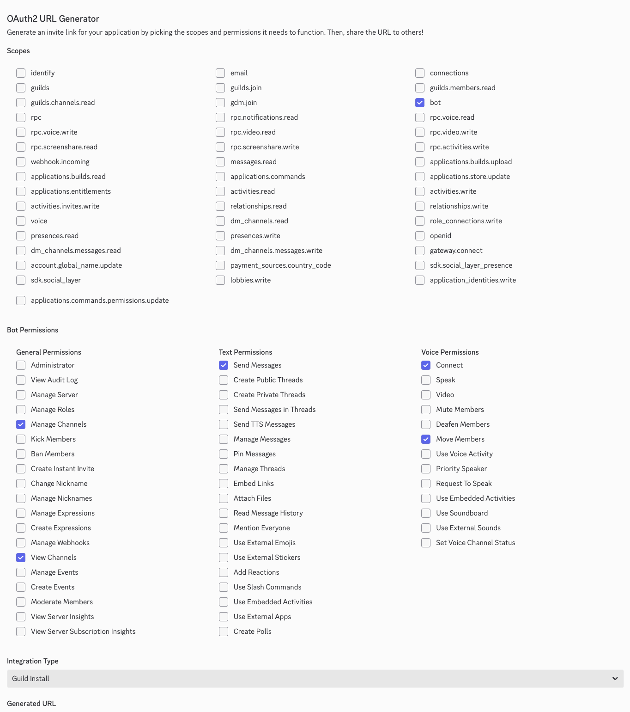

# Introduction

Checkmate is a website constructed by teammate to organize puzzles during Mystery Hunt.

To start a server or to develop, you will need docker.

You will also need credentials in Discord and in Google Drive.

# Setup credentials

Copy `SECRETS.template.yaml` to `SECRETS.yaml`. You will need to populate its values.

## Google Drive credentials

1. Create or select a project [here](https://console.developers.google.com/).
1. [Enable the Drive API Instructions.](https://developers.google.com/drive/api/v3/enable-drive-api)
1. Do the same for the Sheets API.
1. [Create a service account.](https://console.cloud.google.com/iam-admin/serviceaccounts)
1. Create a key and download the json to `credentials/drive-credentials.json`.
   This filename should match `SECRETS.yaml`.
1. [Set up an OAuth 2 client application for Google.](https://developers.google.com/identity/protocols/oauth2)
   1. Use a "web" client type.
   1. Set the authorized redirect urls to
      `https://localhost:8081/accounts/google/login/callback/` and
      `https://example.org/accounts/google/login/callback/`.
   1. Under Audience, add users who should be able to give credentials to
      become the owner of puzzle sheets to the "Test users".
   1. Add the OAuth client ID and secret to `SECRETS.yaml`.

## Discord credentials

1. Create a Discord application [here](https://discord.com/developers/applications).
1. In OAuth2, add `https://localhost:8081/accounts/discord/login/callback/` and
   `https://example.org/accounts/discord/login/callback/` to the redirects
   list.
1. You can use the OAuth2 URL generator to create an invite link to add your
   Discord bot to your server. You need these scopes and should end up with the
   url
   `https://discord.com/oauth2/authorize?client_id=<YOUR_BOT_CLIENT_ID>&permissions=17828880&integration_type=0&scope=bot`
   (replacing `<YOUR_BOT_CLIENT_ID>`).
   
1. Checkmate supports webhooks for new puzzle alerts and solved puzzle alerts.
   Create these webhooks in your Discord server settings (Integrations -> New
   Webhook), and then add the webhook urls to the Bot config in the Django
   admin settings.

# Buying a production server

You can rent or host whatever server you like and it should work fine
as long as it has Docker.

## Example setup with Linode (2026)

Here is one example from 2026 for posterity.

1. I bought a [Linode compute instance](https://www.linode.com/lp/free-credit-100/)
   with Ubuntu on it and [installed Docker on it](https://duckduckgo.com/?q=how+to+install+docker+on+ubuntu&ia=web).
   Docker will pretty much take care of everything,
   so there's no need to e.g. install PostgreSQL separately etc.
1. I added the DNS of our domain with an A record to the IP address of our
   Linode, say `example.org`, so we didn't have to pass IP addresses around.
1. On the Linode, I created a user `mate` with `sudo` access and `docker` group,
   and worked with that user (instead of `root`).
1. I cloned this repository under `~/checkmate` on the server.
1. I ran the `initialize_prod` script on server and created an Django superuser as below.
1. I also went into `/admin` and created a normal user named `teammate`
   with a password, so people who didn't want to use Discord OAuth
   could still connect with that username and password.

People on the tech team added their SSH key
into `~/.ssh/authorized_keys` for ease of access.
An example host config on the local computer:

```
Host checkmate
  User mate
  HostName example.org
  IdentityFile ~/.ssh/id_ed25519
```

In fact, set up this way you no longer need to the password for `mate`,
since everyone should be using public-key authentication anyway.
You probably then want to disable root access, e.g. see
<https://gist.github.com/eliangcs/337beeb3e34e16f617d0>

# Start the server

## Run in production environment

```sh
./scripts/initialize_prod
# This will create an admin user with access to the Django admin panel.
docker compose exec app /app/backend/manage.py createsuperuser --username admin # will prompt to pick a password
```

## Run dev environment

To run in `dev` mode, run the following:

```sh
./scripts/initialize_dev
docker compose exec app /app/backend/manage.py shell -c "from django.contrib.auth.models import User; User.objects.create_superuser('admin', password='admin')"
```

Note that the checkmate-extension zip file is not created in dev mode but it
exists (unzipped) in the repository. The `build_extension` script for Firefox
requires credentials for a Firefox developer account.

You can also run prod mode locally (which can test static build and prod Caddy
setup but not DNS or OAuth redirection) with:

```sh
./scripts/initialize_prod --localhost
```

## Teardown

To stop the server:

```sh
./scripts/teardown
```

## Django admin settings

The admin page is located at `https://example.org/admin`. You shouldn't need
to touch most of this in most cases. This is mainly helpful for setting up
puzzle scraping, Discord alerting, and deleting accidental / duplicate puzzles
and rounds.

There should only be at most one instance of the Bot config and Hunt config.
(This will be enforced by the backend, so you won't be able to mess this up.)
Defaults are used if the respective config does not exist.

The primary config you might want to edit is the Bot config. This tells the
scraper how to login, and what page has the list of puzzles. To enable
scraping, you should expect to need to parse out the puzzles from the page in
python. In the unexpected case that the Hunt site is exceedingly complex, you
may also need to fiddle with the scraper to make it auth as your team
correctly. This contains the checkbox to enable scraping for real.

The Bot config is also where you can define the webhook urls that can be used
to send Discord alerts when new puzzles are created and when puzzles are marked
as solved.

The Hunt config generally does not need to be created. It does have some niche
options like coloring puzzles on the main sheet based on tags, if you also
define tags in the admin panel for a round.

Rounds and puzzles can only be deleted from the admin panel. Additionally, you
can update round / puzzle metadata here. Note that puzzle scraping uses a mix
of round name and round link for determining which rounds are new, and uses the
puzzle link for determining which puzzles are new. Messing with the name or
link values could cause duplicates to be created the next time the scraper is
run.

# Utilities

## Puzzle autocreation / scraping

If you implement an all puzzles page parser, Checkmate can auto-scrape for new
puzzles every minute. (This needs to be setup during the Hunt because you need
to know how the Hunt site is structured.)

This is done in [backend/services/scraper.py](./backend/services/scraper.py)
and
[backend/services/scraper_examples.py](./backend/services/scraper_examples.py).

In [backend/services/scraper.py](./backend/services/scraper.py), you will need
to make `async_parse_html` parse the all puzzles page and return a dict of
rounds and puzzles. See that file for more info.

To test autocreating puzzles, use this command:

```sh
docker compose exec -w /app/backend app celery -A checkmate call services.tasks.auto_create_new_puzzles
```

This will be a `dry_run` by default and will print a task id. To check the result, use:

```sh
docker compose exec -w /app/backend app celery -A checkmate result [TASK_ID]
```

or if there was an error:

```sh
docker compose exec -w /app/backend app celery -A checkmate result --traceback [TASK_ID]
```

## Database export

To migrate a postgres database between servers:

```sh
# on old server
docker compose exec -u postgres postgres pg_dump postgres > dumpfile.dump
# on new server
docker compose exec -T -u postgres postgres psql -U postgres < dumpfile.dump
```

## Checkmate browser extension

The Checkmate browser extension is needed to display Discord within the
Checkmate website. Sometimes this is also needed to display the Hunt website
within Checkmate (depending on the Hunt website's x-frame-options).

To build a new version of the Checkmate browser extension for Chrome, run

```sh
docker compose exec app /app/build_extension
```

Firefox needs a signed version of the app. You can sign one with this command.

```sh
docker compose exec app /app/build_extension --sign
```

Note that Firefox will only sign a version number once, so the version needs to
be incremented each time.

If not modifying extension code, then neither of these steps are necessary, and
Checkmate will construct the Chrome extension from source and distribute the
Firefox extension from the `web-ext-artifacts` folder.
